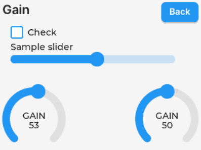

# Seven Deadly Synths
## What is a Modular Synth?
A modular synth is a type of synthesizer that is made from seperate modules connected together via patch cables. Each module has a separate, specific function. They may take in, manipulate, and output control voltages or audio signals. These modules connect together to create something more complicated and interesting than each individual effect. By combining multiple simple effects, you can use a modular synth to make complex, unique sounds.

#### Eurorack
The most common format for modular synths is Eurorack. Eurorack specifies the height, width, and voltages of modules. This allows modules from different manufacturers to be used together. The width of a module is a multiple of .2 in (5.08 mm) and the height is 3U (128.5 mm). The standard voltage range is -10v to 10v.

### Why Modular Synths?
Modular synths, especially Euroracks, are a staple in music production because of their flexibility and versatility, allowing users to design and reconfigure their instruments on the fly. As the needs of a user changes, they can get additional modules that work with their existing tools. They are physical and tactile--much like a physical instrument, feedback from a modular synth lets the user feel a connection to the music that software often lacks.

### Problems with Synthesizers

#### Expensive
Modular synths are expensive. A single module containing circuitry that a Sophomore in Electrical Engineering could design could easily cost $200. Combining these into a full system could cost thousands of dollars.

#### Single Function
Each module has a single function. Once you spend money on a module, it can only accomplish one effect. After that, if you don't need it for a particular sound, it just takes up space.

## Our Module
We are developing a Eurorack-compliant module capable of taking on the behavior of any module. Through a simple GUI, the user can switch between different effects so they can always have a use for the module. Additional effects can be written in C by using our simple API. The module is affordable to help lower the barrier to entry for modular synthesizers. Using this tool, anyone with an idea and some programming knowledge could create their own custom effect.

### Features
- 4 Inputs/4 Outputs
- 3.5" Touchscreen
- -10v to 10v Output Range
- 24 Bit 48kHz Audio
- 240 MHZ ESP32-S3 Processor
- 4 Unused GPIO pins for the user

## Demo Day
Our synthesizer will be demonstrated on December 5th from 10 AM to noon. It will have a number of basic effects that will let a user make sounds by connecting different effects together. We will also let the user apply effects to input audio, such as regular music from a laptop or a keyboard. The GUI will be similar to the example below:

## Additional Resources
Details about the hardware and API to help users create effects will be added to our [repo](https://github.com/Senior-Project-Modular-Synthesizer/SynthCodeESPIDF). Four additional GPIO pins are available on the board.  
For more information about the hardware (including GPIO pins), please visit the [ESP32 S3 documentation page](https://docs.espressif.com/projects/esp-idf/en/stable/esp32s3/get-started/index.html).
